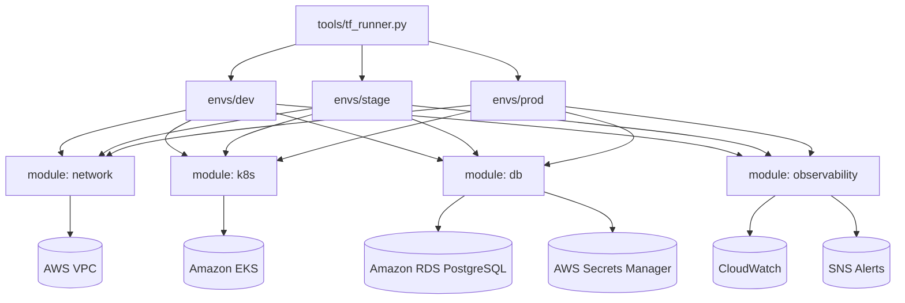

# ax-terraform-cloud-baseline

Production-grade Terraform baseline for Axelliant Software Engineering with secure-by-default AWS infrastructure modules, environment isolation, CI enforcement, and operational workflows.

Contact: https://axelliant.com | info@axelliant.com | security@axelliant.com

## Overview

`ax-terraform-cloud-baseline` is an enterprise-ready Terraform repository that establishes repeatable cloud foundations across `dev`, `stage`, and `prod`.

The AWS baseline is fully implemented and includes:
- VPC networking with segmented subnet tiers
- EKS cluster baseline with private API endpoint by default
- RDS PostgreSQL baseline with managed credentials in AWS Secrets Manager
- CloudWatch/SNS observability baseline

An Azure template starter is included under `templates/azure-baseline/` for multi-cloud expansion.

## Why This Exists

Teams frequently lose velocity by re-solving account bootstrap, tagging policy, networking layout, and secure defaults for every project. This repository standardizes those controls once, then enables safe delivery workflows through:
- environment isolation (`envs/dev`, `envs/stage`, `envs/prod`)
- module composition (`modules/network`, `modules/k8s`, `modules/db`, `modules/observability`)
- CI guardrails for formatting and validation
- documented plan/apply workflows that avoid credential leakage and unsafe changes

## Features

- AWS production baseline modules with composable interfaces
- Security-first defaults:
  - private subnet placement for workloads and databases
  - encrypted RDS storage
  - generated DB secrets via external secret manager (AWS Secrets Manager)
  - EKS API endpoint private access enabled by default
- Standardized tags for governance and chargeback
- Structured logging Terraform runner (`tools/tf_runner.py`) with optional OpenTelemetry context fields
- Pre-commit hooks for Terraform format and validate
- GitHub Actions for CI, security scans, and Docker build artifacts
- Automated release tags and changelog updates using Release Please
- Dockerized execution path for deterministic local workflows

## Architecture



## Quickstart

### 1. Prerequisites

- Terraform >= 1.6
- Python >= 3.12
- AWS CLI authenticated (`AWS_PROFILE` or role-based auth)
- GNU Make

### 2. Setup local tooling

```bash
make setup
```

### 3. Create environment inputs

```bash
cp envs/dev/terraform.tfvars.example envs/dev/terraform.tfvars
cp envs/dev/backend.hcl.example envs/dev/backend.hcl
```

### 4. Run safe bootstrap and plan (dry-run)

```bash
make bootstrap ENV=dev
make plan ENV=dev
```

### 5. Validate modules and environments

```bash
make smoke
```

## Configuration

### Environment Variables (`.env.example`)

- `AWS_PROFILE`: AWS named profile used by Terraform/AWS SDK.
- `AWS_REGION`: target default region.
- `TF_IN_AUTOMATION`: enables non-interactive Terraform behavior.
- `TF_INPUT`: disables interactive variable prompts.
- `OTEL_EXPORTER_OTLP_ENDPOINT`: optional OpenTelemetry collector endpoint for structured log context.
- `OTEL_TRACE_ID`: optional trace ID override.
- `AX_ENV`: default environment helper variable (`dev`, `stage`, `prod`).

### Terraform Variable Files

Each environment defines independent values in:
- `envs/dev/terraform.tfvars`
- `envs/stage/terraform.tfvars`
- `envs/prod/terraform.tfvars`

### Tagging Standards

All environments apply these required tags through provider default tags:
- `Project`
- `Environment`
- `Owner`
- `CostCenter`
- `ManagedBy`
- `DataClass`

## API/CLI Usage

`tools/tf_runner.py` wraps Terraform commands with structured logging and optional OTEL context metadata.

### Bootstrap

```bash
python tools/tf_runner.py bootstrap --env dev --backend-config backend.hcl
```

### Plan

```bash
python tools/tf_runner.py plan --env dev --var-file terraform.tfvars --plan-file tfplan
```

### Apply

```bash
python tools/tf_runner.py apply --env dev --plan-file tfplan
```

### Dry-run (safe preview)

```bash
python tools/tf_runner.py plan --env dev --dry-run
```

## Examples

- `examples/iam/least-privilege-policy.json`: scoped policy starter for CI plan-only workflows.
- `templates/azure-baseline/`: Azure baseline template folder for multi-cloud extension.
- `make run ENV=dev`: runnable MVP command path that executes the Terraform runner in dry-run mode.

## Testing

- Unit tests: `tests/unit/test_tf_runner.py`
- Integration smoke test: `tests/integration/test_smoke_cli.py`
- Terraform smoke validation: `scripts/terraform_validate_all.sh`

Run all Python tests:

```bash
make test
```

Run Terraform smoke validation:

```bash
make smoke
```

## Deployment (Docker)

Build image:

```bash
make docker-build
```

Run via Docker Compose:

```bash
docker compose up --build
```

The container includes Terraform, Python tooling, and repo scripts for repeatable execution.

## Security Notes

- Do not commit `*.tfvars`, backend files, or secrets.
- DB credentials are generated and stored in AWS Secrets Manager via `manage_master_user_password = true`.
- Keep EKS API endpoint private in production (`endpoint_public_access = false`).
- Use narrow IAM permissions for CI and human operators. Example policy is in `examples/iam/least-privilege-policy.json`.
- Report vulnerabilities to security@axelliant.com.

## Roadmap

1. Expand Azure implementation to parity with AWS modules (AKS, private endpoints, PostgreSQL, Monitor).
2. Add policy-as-code enforcement (OPA/Conftest or Sentinel-compatible checks).
3. Introduce cost anomaly alarms and budget actions per environment.
4. Add optional OpenTelemetry exporters for wrapper CLI traces.

## Contributing

Contributions are welcome. See `CONTRIBUTING.md` and `CODE_OF_CONDUCT.md` before opening a pull request.

## License

Licensed under Apache-2.0. See `LICENSE`.
